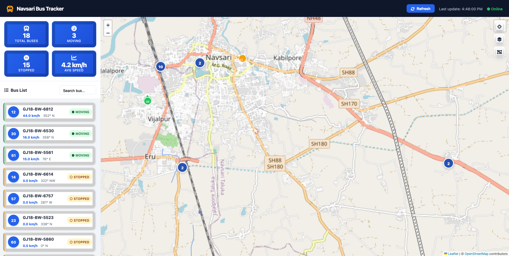

# Navsari Live Bus Tracker

[](https://developer.mozilla.org/en-US/docs/Web/HTML)
[](https://developer.mozilla.org/en-US/docs/Web/CSS)
[](https://developer.mozilla.org/en-US/docs/Web/JavaScript)
[](https://leafletjs.com)
[](https://www.openstreetmap.org)
[](LICENSE)

A real-time bus tracking dashboard for **Navsari, Gujarat, India**. The application polls a live GPS fleet-management API and renders every bus on an interactive map with directional markers, speed, heading, and trail history — all with no backend and no API key required.

---

## Screenshot



---

## Features

- **Live GPS tracking** — auto-refreshes every 10 seconds from the fleet API
- **Directional SVG markers** — each bus icon rotates to indicate its actual heading; a pulsing ring highlights moving vehicles
- **Polyline trail** — shows each bus's recent path on the map
- **Sidebar dashboard** — fleet-wide metrics (total, moving, stopped, average speed) and a searchable, sortable bus list
- **Marker clustering** — groups nearby buses at lower zoom levels for a clean view; toggleable
- **Multiple map styles** — switch between OpenStreetMap standard, HOT Humanitarian, and OpenTopoMap tiles
- **Bus detail modal** — one-click deep-dive with coordinates, speed, bearing, and a direct OpenStreetMap link
- **Fully responsive** — works on desktop, tablet, and mobile
- **Zero dependencies to install** — pure HTML/CSS/JS, served directly from the filesystem or any static host

---

## Technology Stack

| Layer | Technology |
|---|---|
| Map rendering | [Leaflet.js](https://leafletjs.com) 1.9.4 |
| Map tiles | [OpenStreetMap](https://www.openstreetmap.org) (free, no key) |
| Marker clustering | [Leaflet.markercluster](https://github.com/Leaflet/Leaflet.markercluster) 1.5.3 |
| Icons | [Font Awesome](https://fontawesome.com) 6.4.2 |
| GPS data source | Locanix Fleet Management API (JSONP) |
| Language | Vanilla JavaScript (ES6+), HTML5, CSS3 |
| Runtime | Any modern browser — no build step, no framework |

---

## Getting Started

### 1. Clone the repository

```bash
git clone https://github.com/jay6430/navsari-bus-tracker.git
cd navsari-bus-tracker
```

### 2. Open in a browser

For the simplest setup, serve the `bus-tracker` directory with any static HTTP server:

```bash
# Python (built-in)
python3 -m http.server 8080 --directory bus-tracker

# Node.js (npx)
npx serve bus-tracker
```

Then open `http://localhost:8080` in your browser.

You can also open `bus-tracker/index.html` directly as a `file://` URL — the JSONP data fetch works without a server.

---

## Project Structure

```
navsari-bus-tracker/
├── bus-tracker/
│   ├── index.html          # Application shell
│   ├── css/
│   │   └── styles.css      # Design system and responsive layout
│   ├── js/
│   │   ├── app.js          # API polling, data normalisation, app state
│   │   ├── map.js          # Leaflet map, SVG markers, polyline trails
│   │   └── dashboard.js    # Sidebar bus list, search, modal
│   └── assets/
│       └── screenshot.png
├── collect_bus_data.py     # Script to log raw GPS feed to CSV
├── dashboard.py            # Streamlit analytics dashboard (historical data)
├── bus_tracking_data.csv   # Sample collected GPS data
└── README.md
```

---

## How It Works

1. `app.js` fires a JSONP request to the Locanix fleet API every 10 seconds.
2. The raw response is normalised — speed converted from m/s to km/h, Unix timestamps formatted, cardinal directions derived from compass bearing.
3. Per-bus coordinate history (up to 100 points) is maintained in memory for polyline trails.
4. `map.js` renders each bus as an inline SVG marker: an arrowhead + circle group rotated to the GPS heading, with the short bus label counter-positioned so it remains upright regardless of direction.
5. `dashboard.js` populates the sidebar list, handles search filtering, and wires up the detail modal.

---

## Testing

This web app was tested on [TestGrid's TestOS](https://testgrid.io) platform.
---

## Data Source

Bus positions are sourced from the **Locanix Fleet Management System** API. The Gujarat State Road Transport Corporation (GSRTC) / local fleet operator exposes live GPS telemetry including:

- Latitude / Longitude (WGS84)
- Speed (m/s, converted to km/h)
- Compass heading (degrees, 0 = North)
- Timestamp (Unix epoch)

---

## License

This project is released under the [MIT License](LICENSE).

---

## Author

**Jay Kadam** — [github.com/jay6430](https://github.com/jay6430)
